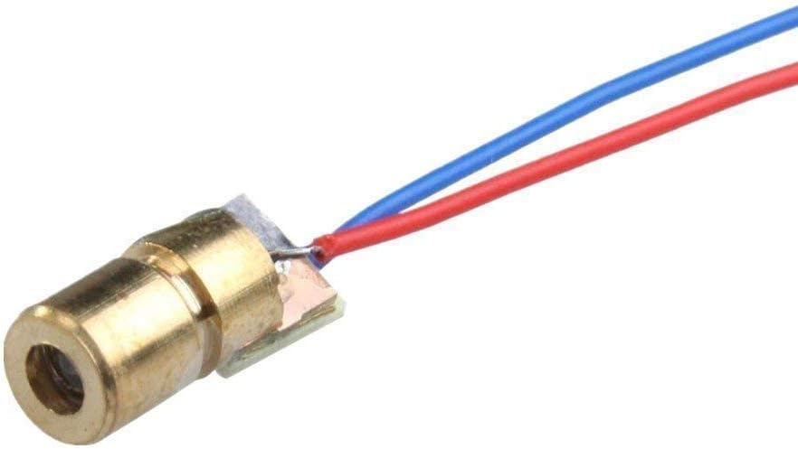
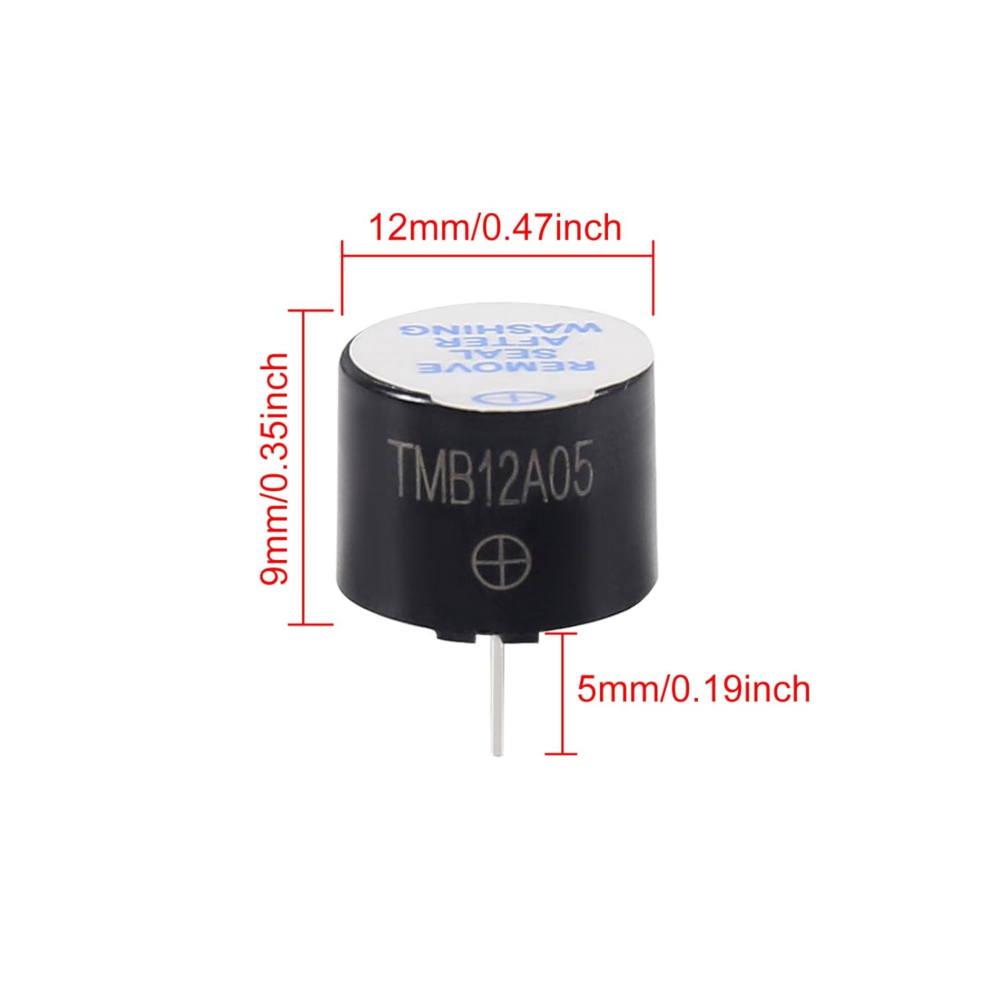
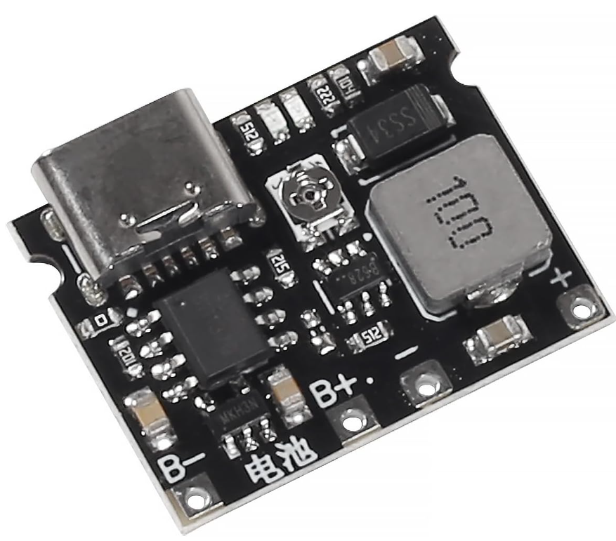
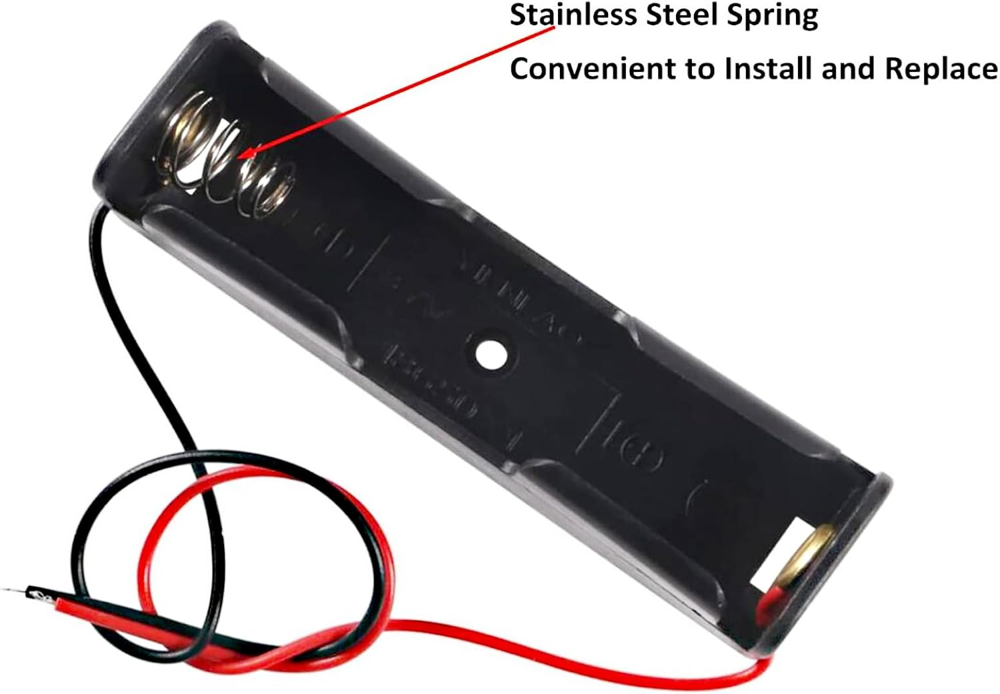
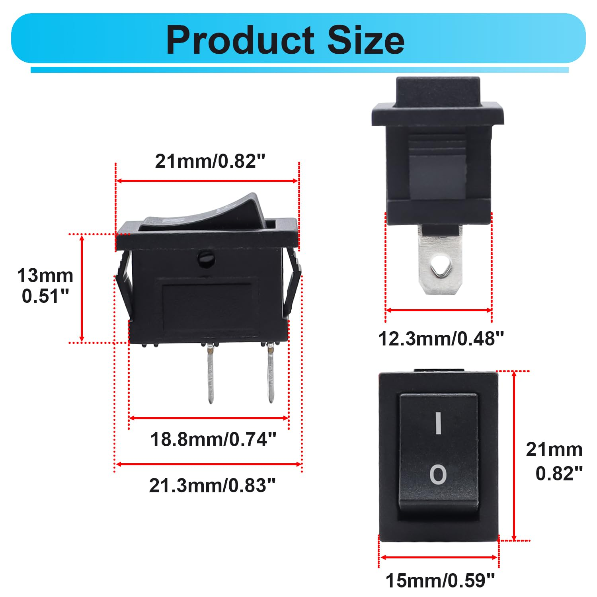

# Enclosure Design Decisions

This document outlines the design decisions made for the enclosure of the trip
sensor for the project. The enclosure is designed to house the laser emitter,
phototransistor receiver, and associated component electronics providing
protection and proper alignment for accurate operation.

## Design Considerations

- **Durability**: The enclosure must be robust enough to withstand the
  environment of a curling rink, including potential impacts and moisture.
- **Alignment**: The design must ensure precise alignment of the laser and
  phototransistor for accurate detection.
- **Ease of Assembly**: The enclosure should be easy to assemble and disassemble
  for maintenance and adjustments (e.g. where soldering is required, only use
  through-hole components).
- **Accuracy**: The enclosure must minimize external light interference to
  ensure reliable operation of the phototransistor (e.g. light tunneling).

## Current Needs Before Design

- [x] **PCB Design**: Finalize the PCB design to determine exact mounting points
  and dimensions for the enclosure.
- [ ] **Component Dimensions**: Verify the dimensions of all components for
  accurate enclosure design.

## Involved Components

### Laser Diode Module

The laser diode module used is a standard 650nm red laser module, with an 6mm OD
housing that includes a small notch in the middle for placement. A small circuit
board is attached to the back of the laser module that includes a resistor for
current limiting and a positive and ground wire.

> NOTE: The reflector design was initially based on retroreflective tape, but
> this was found to be unreliable at distances beyond 1-2 meters. The design has
> been updated to use small bicycle retroreflectors for improved reliability.
> Still need to field test this change - especially with bright overhead
> lighting and reflective ice surfaces. An initial test of some rectangular
> reflectors was unreliable at 3-4 meters, but a standard bicycle reflector
> performed much more reliably.

### Main PCB Module

The main PCB module houses the main circuitry for the project. The PCB is
designed to fit within the enclosure and provide connections for ESP32 dev
board, power, laser, and phototransistor. The PCB is also designed to align the
phototransistor with the enclosure opening for optimal light detection and ease
of alignment. A 5-position DIP switch is included on the PCB for sheet and
placement ID selection, but does need to be externally accessible as the values
are not changed frequently.

\#\#\# No Photo Available Yet

### Piezo Buzzer Module

The piezo buzzer module is used to provide audio feedback for user interactions
such as power on/off and timing events. The buzzer is mounted on the main PCB
and positioned within the enclosure to allow sound to escape effectively. The
buzzer is an active type, meaning it includes an internal oscillator and only
requires a DC voltage to operate.

### TP4056 Battery Charger Module with 5V Step-Up

The TP4056 battery charger module is used to charge the 18650 Li-ion battery. It
is mounted separately from the main PCB to allow for use of a development board
instead of integrating the charger and associated SMD components into the main
PCB (keeping the project hobbyist friendly). It has a USB-C connector for easy
charging. The module also includes LED indicators for charging status. It has an
integrated step-up converter to provide a regulated 5V output for the ESP32 dev
board and other components.

### 18650 Battery Holder

The 18650 battery holder is used to securely hold the battery within the
enclosure. It includes leads for easy connection to the main PCB.

### Rocker Switch

The rocker switch is used to control power to the device. It is mounted on the
enclosure for easy access and large enough to operate while wearing thin gloves.

### External Antenna

An external 2.4GHz antenna is used to improve the wireless range of the ESP32
dev board. The antenna is connected via an IPEX connector on the ESP32 board and
is mounted externally to the enclosure for optimal signal reception.

