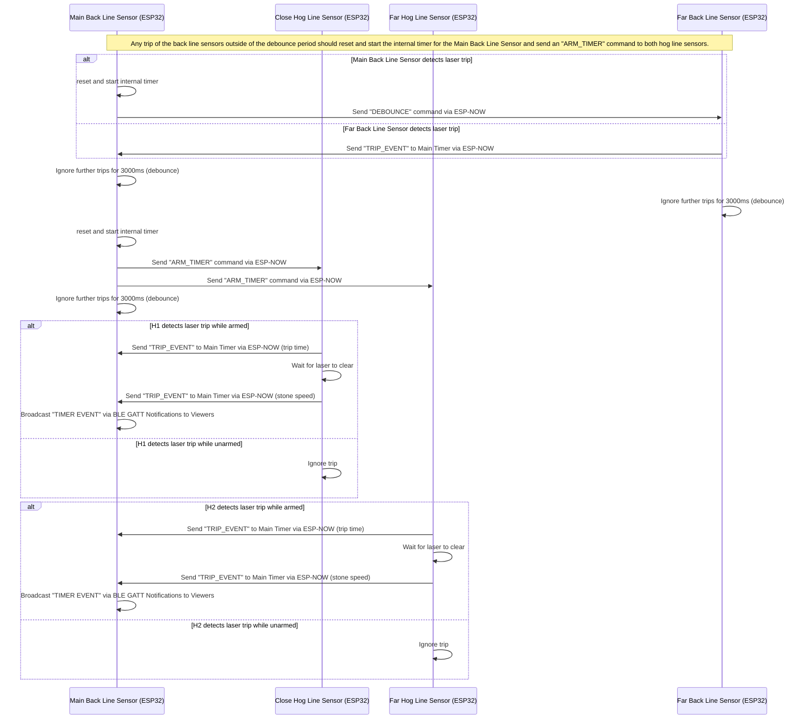

# Firmware Sequence Diagrams

## Timer Event Flow

```mermaid
sequenceDiagram
  participant BL1 as Main Back Line Sensor (ESP32)
  participant H1  as Close Hog Line Sensor (ESP32)
  participant H2  as Far Hog Line Sensor (ESP32)
  participant BL2 as Far Back Line Sensor (ESP32)

  Note over BL1,BL2: Any trip of the back line sensors outside of the debounce period should reset and start the internal timer for the Main Back Line Sensor and send an "ARM_TIMER" command to both hog line sensors.

  alt Main Back Line Sensor detects laser trip
    BL1->>BL1: reset and start internal timer
    BL1->>BL2: Send "DEBOUNCE" command via ESP-NOW
  else Far Back Line Sensor detects laser trip
    BL2->>BL1: Send "TRIP_EVENT" to Main Timer via ESP-NOW
  end

  BL1->>BL1: Ignore further trips for 3000ms (debounce)
  BL2->>BL2: Ignore further trips for 3000ms (debounce)
  BL1->>BL1: reset and start internal timer
  BL1->>H1: Send "ARM_TIMER" command via ESP-NOW
  BL1->>H2: Send "ARM_TIMER" command via ESP-NOW
  BL1->>BL1: Ignore further trips for 3000ms (debounce)

  alt H1 detects laser trip while armed
    H1->>BL1: Send "TRIP_EVENT" to Main Timer via ESP-NOW (trip time)
    H1->>H1: Wait for laser to clear
    H1->>BL1: Send "TRIP_EVENT" to Main Timer via ESP-NOW (stone speed)
    BL1->>BL1: Broadcast "TIMER EVENT" via BLE GATT Notifications to Viewers
  else H1 detects laser trip while unarmed
    H1->>H1: Ignore trip
  end

  alt H2 detects laser trip while armed
    H2->>BL1: Send "TRIP_EVENT" to Main Timer via ESP-NOW (trip time)
    H2->>H2: Wait for laser to clear
    H2->>BL1: Send "TRIP_EVENT" to Main Timer via ESP-NOW (stone speed)
    BL1->>BL1: Broadcast "TIMER EVENT" via BLE GATT Notifications to Viewers
  else H2 detects laser trip while unarmed
    H2->>H2: Ignore trip
  end
```
