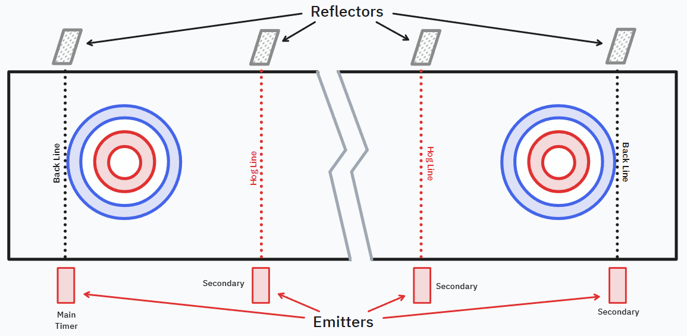

# 🥌🥌🥌 Full Sheet Curling Timer 🥌🥌🥌

The purpose of this repository is to explore an inexpensive, ESP32-based, laser
trip timer for full sheet timing (4 lasers, 2 at each back line and 2 at each
hog line). Access to the times recorded by the timer is provided via a simple
web interface that connects to an ESP32 using the Web Bluetooth API. One ESP32
acts as a BLE Peripheral that hosts a custom GATT service for the timer, and all
four ESP32 devices will act as event detectors (laser trip detection) which
communicate the event data via ESP-NOW protocol to be picked up by the BLE
peripheral.

## License

This project is licensed under the Business Source License 1.1 (BUSL).
You may use it freely for noncommercial purposes.
For commercial use, please contact [nathan@z-nerd.com](mailto:nathan@z-nerd.com)
to obtain a commercial license.

## Goals

- **💸 Low-cost hardware**: inexpensive components (e.g., ESP32, laser modules)
  to keep single sheet cost under $150 (less when building for multiple sheets).
- **✅ Easy fabrication**: 3D-printable enclosure and PCBs for hobbyist skill
  level assembly (or schematics for breadboard assembly).
- **⏱️ Accurate timing**: millisecond-level accuracy for splits.
- **⚙️ Easy Setup and Use**: non-technical friendly setup and operation with
  guidance for setup and calibration provided in the web UI.
- **👀 Full sheet support**: support dual split timing (back line to hog line,
  and hog line to hog line) and bi-directional throws without moving hardware.
- **👨‍👩‍👧‍👦 Multi-viewer support**: allow multiple phones/tablets to connect and view
  timing data simultaneously.
- **🌐 Native App**: simple native app accessible from any modern platform
  with Bluetooth support - no cloud services, no complicated Wi-Fi setup for
  devices.

## Architecture (Multi-viewer)

### Roles and data flow

- **Main Timer and Laser Sensor - ESP32 = BLE Peripheral (GATT Server)**
  - Advertises a custom "Timer Service" so clients can discover it.
  - Has an assigned sheet ID (via dip switches) for identification.
  - Has an assigned placement ID (via dip switches) for sheet position.
  - Receives laser trip events from self and secondary timer devices (ESP-NOW).
  - Hosts characteristics for state + events.
  - Pushes timing updates using **notifications**.

- **Secondary Timer Devices - ESP32s = ESP-NOW Sender**
  - Has an assigned sheet ID (via dip switches) for identification.
  - Has an assigned placement ID (via dip switches) for sheet position.
  - Communicates laser trip events via ESP-NOW protocol.

- **Viewer (browser/web UI) = BLE Central (GATT Client)**
  - Scans for timer devices (filtered by name/service UUID).
  - Connects to **one** timer device at a time.
  - Provides diagnostics and setup UI.
  - Reads current timer state upon connection.
  - Subscribes to notifications to receive live updates.

This pattern supports multiple viewers concurrently: each viewer connects and
enables notifications independently.

### BLE Advertising For Viewer Discovery

To make it easy to pick the right timer when multiple devices are nearby, each
device should include clear identity in advertising:

- **Device name**: e.g., `CurlTimer Sheet 3`
- **Advertised Service UUID**: `Timer Service` (custom UUID)
- **Optional service/manufacturer data**: e.g., `sheetId`, `deviceId`,
  `firmwareVersion`

### GATT Service Model (proposed)

GATT is used for structured data exchange between the timer device and viewer.
GATT is well-suited for this use case due to its efficient notification
mechanism for real-time updates. Implementation details are discussed in the
[firmware design decisions](design_decisions.md) document.

### Device-to-Device ESP-NOW Communication Model

ESP-NOW is the proposed protocol for communication between the laser sensors
and the main timer device. ESP-NOW was considered over BLE Advertising due to
better reliability and lower latency. Implementation details are discussed in
the [firmware design decisions](design_decisions.md) document.

### Notes for future consideration

- WebKit has no support (actively opposes) for the Web Bluetooth API, and all
  iOS browsers are forced to use WebKit (with the exception of EU member
  states). Therefore, iOS support is not feasible with the current Web Bluetooth
  API limitations. Need to switch to a native app, which will bring added
  complexity. Looking at Avalonia for cross-platform native app development.
- It is possible to infer the direction of travel from the sequence of laser
  trip events, so that a stone passing the opposing back line does not cause a
  new timing event. However, this may be error-prone if stones are being thrown
  closely together in timing in opposite directions. Explicit direction setting
  from the viewer may be more reliable but requires user interaction which may
  be inconvenient or undesirable during practice.
- It may be useful to calculate the rock speed at each trip point and include
  that in the event data sent to viewers.
- **Timing accuracy note**: ESP-NOW retries/bursts improve delivery reliability
  but can add variable *arrival latency*. To keep recorded split times accurate,
  trip events should include a **sender-side capture timestamp** (taken at the
  instant the beam transition is detected), and the main timer should map that
  to its own clock using a lightweight beacon-based offset estimate.

## Wish List

- [ ] Apple WatchOS App for on-ice timing
- [ ] Garmin Connect IQ App for on-ice timing
